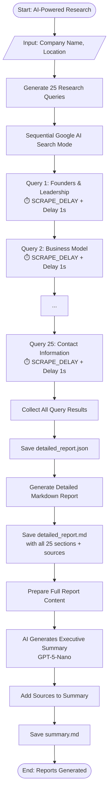

## Lead Extractor

Minimal web crawler project with two separate implementations.

- **If using `uv`**: run `uv sync` to install dependencies from `pyproject.toml`.
- **If using `pip`**: create a venv, then install with `pip install -e .` (or `pip install .`) so `pyproject.toml` is used as the source of dependencies.
- Add your `OPENAI_API_KEY` to .env

---

### Project structure

**Google AI mode**

```text
google_results/
  ... (generated result files)

ai_mode.py
streamlit_ai.py
```

**Manual scraper**

```text
results/
  ... (generated result files)

config.py
utils.py
google_search.py
find_urls.py
scrape.py
summarize.py
streamlit_scrape.py
```

---

### How to run

- **Google AI mode app**
  - `streamlit run streamlit_ai.py`

- **Manual scraper app**
  - `streamlit run streamlit_scrape.py`

---

### AI mode workflow


---

### Scraper workflow

